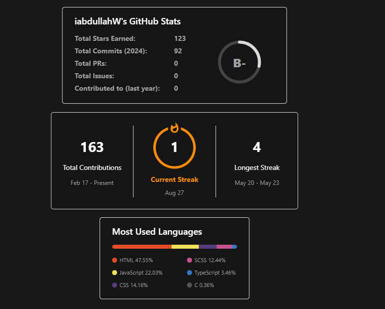

<h1 align="center">Hey, I'm Muhammad Abdullah</h1>
<h4 align="center">Junior Developer</h3>

### Tech Stack:

 
 
 

### Connect with me:
<!-- [][website] -->
[][linkedin]
[][kaggle]
[][instagram]

 
 
 

[website]: https://yash1200.github.io/#/
[company]: https://github.com/iabdullahW
[website]: https://ahsanali.github.io/#/
[linkedin]: https://www.linkedin.com/in/i-abdullah/
[kaggle]: https://www.kaggle.com/iabdullahw
[instagram]: https://www.instagram.com/abdullahhhh.w/?hl=en